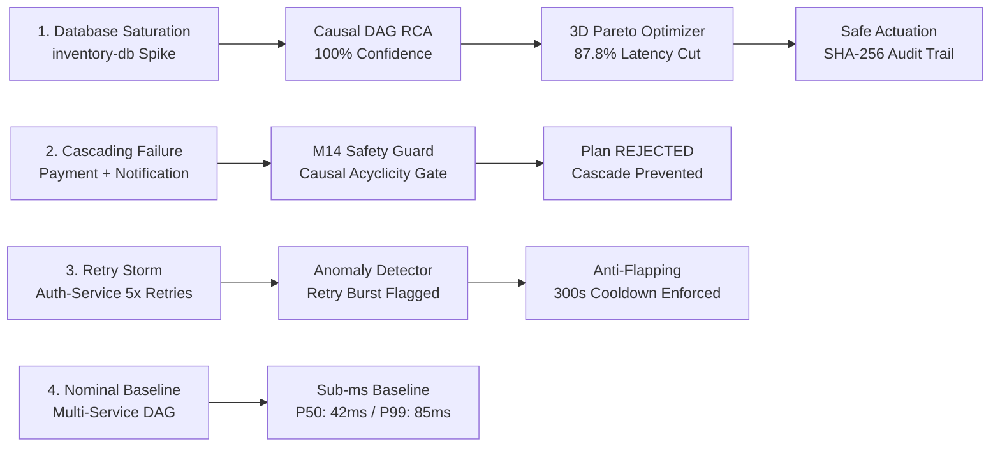

# TraceMind — Technical Showcase & Demonstration Guide

> **Target Audience**: Software Engineers, Technical Interviewers, System Architects, and Engineering Leaders  
> **Platform Version**: `0.15.0` (Milestones 0–15 Complete)  
> **Environment Profile**: Zero-Cost, In-Memory Actuator, Isolated Demo Mode

---

## 1. Executive Demonstration Overview

TraceMind is an end-to-end distributed workflow intelligence, observability, and autonomous closed-loop self-healing platform.

This demo profile is engineered to provide a **safe, 100% reproducible, zero-recurring-cost demonstration** of all 16 platform milestones (`M0`–`M15`).

### Key Demo Safeguards
* **Zero External Cloud Costs**: Uses an offline, deterministic ReAct AI Analyst (`MockLLMClient`). Zero external paid API calls or cloud dependencies.
* **Safe In-Memory Actuation**: All remediation actions (traffic diversion, circuit breaking) operate strictly inside an in-process simulation dictionary (`InMemoryRoutingActuator`). No outbound network packets, webhooks, or real infrastructure mutations are possible.
* **Public Port Isolation**: Only Nginx (Port `80` or `5173`) is exposed to the host. PostgreSQL (`5432`), Kafka (`9092`), Prometheus (`9090`), Grafana (`3000`), and API (`8000`) remain strictly isolated on the private Docker bridge.
* **Pre-Seeded Showcase Scenarios**: A single bootstrap command seeds 4 deterministic incident scenarios with ground-truth root-cause evidence and cryptographic audit trails.

---

## 2. Quickstart: Launching the Demo

### Option A: 1-Click GitHub Codespaces (Browser)

1. Navigate to the [TraceMind GitHub Repository](https://github.com/rishabh211200/TraceMind).
2. Click **Code** $\rightarrow$ **Codespaces** $\rightarrow$ **Create codespace on main**.
3. Codespaces automatically starts `docker-compose.demo.yml` and runs the bootstrap seeder.
4. When prompted, click **Open in Browser** on port `80` (or visit the forwarded ports tab).

---

### Option B: Local Docker Compose (One Command)

```bash
# 1. Clone repository
git clone https://github.com/rishabh211200/TraceMind.git
cd TraceMind

# 2. Launch demo topology
docker compose -f docker-compose.demo.yml --env-file .env.demo up --build -d

# 3. Seed baseline telemetry, ML models & 4 showcase scenarios
docker compose -f docker-compose.demo.yml exec api python scripts/demo_bootstrap.py

# 4. Open in browser:
#    http://localhost
```

---

## 3. Demo Showcase Credentials & Access Points

> ⚠️ **DEMO-ONLY CREDENTIALS NOTICE**:  
> All credentials listed below (`admin@tracemind.io`, `TraceMind#Admin2026!`, `tm_live_demo_...`) are strictly ephemeral, deterministic demo values generated locally by `scripts/demo_bootstrap.py` in your local container database. They have **zero access** to any external cloud service, production infrastructure, or public network.

| Resource | URL / Port | Credentials / Notes |
|---|---|---|
| **TraceMind Web Dashboard** | `http://localhost` (or Codespaces Port 80) | Public read-only exploration by default (`Role.VIEWER`). |
| **System Admin Login** | Click **Security** $\rightarrow$ Sign In | Email: `admin@tracemind.io`<br>Password: `TraceMind#Admin2026!` (Demo Only) |
| **Guest Viewer Login** | Click **Security** $\rightarrow$ Sign In | Email: `viewer@tracemind.io`<br>Password: `Viewer#Demo2026!` (Demo Only) |
| **Fixed Demo API Key** | Header: `X-API-Key` | `tm_live_demo_0123456789abcdef0123456789abcdef` (Demo Only) |
| **OpenAPI Swagger UI** | `http://localhost/docs` | Interactive REST & SSE API documentation. |
| **Prometheus Raw Metrics** | `http://localhost/metrics` | Proxied through Nginx. |

---

## 4. The 4 Deterministic Showcase Scenarios

The bootstrap seeder initializes 4 realistic failure scenarios ready for live walkthroughs:



### Scenario 1: Database Saturation & Autonomous Closed-Loop Self-Healing
* **What Happened**: Chaos injection simulated IOPS exhaustion and queue backup on `inventory-db` (latency jumped from 20ms to 1,200ms).
* **Where to Inspect in UI**:
  1. **Executions View**: Click on the degraded execution -> Observe span waterfall timeline and open the **TreeSHAP drawer** showing `inventory-db` latency driving 84% of the failure probability.
  2. **Root Cause View**: View the causal DAG traversal identifying `inventory-db` as the primary culprit (100% confidence).
  3. **Optimizer View**: Inspect the 3D Pareto scatter plot and side-by-side workflow diff showing an alternate route bypassing the database cache with an **87.8% latency reduction**.
  4. **Remediation View**: Inspect the executed plan, safety invariant checks (blast radius 20%), and the immutable **SHA-256 cryptographic audit ledger** entry.

### Scenario 2: Cascading Failure & Safety Invariant Rejection
* **What Happened**: Cascading failure across `payment-service` and `notification-service`.
* **Where to Inspect in UI**:
  1. **Remediation View**: Inspect the plan with status `REJECTED_SAFETY_VIOLATION`.
  2. Notice the safety guard violation: `Causal Acyclicity Invariant Violation` (the system refused to actuate a diversion route that routed traffic back into an active culprit).

### Scenario 3: Upstream Retry Storm & Anti-Flapping Cooldown
* **What Happened**: High failure rate triggered rapid retries on `auth-service`.
* **Where to Inspect in UI**:
  1. **Anomalies View**: Filter by `CASCADE` anomalies -> Observe retry storm burst ($\ge 3$ retries).
  2. **Remediation View**: Observe anti-flapping protection enforcing the 300-second cooldown window.

### Scenario 4: Nominal Workload & HPC Performance Baseline
* **What Happened**: Clean baseline order fulfillment executions with zero incidents.
* **Where to Inspect in UI**:
  1. **Topology View**: All 8 microservices show `HEALTHY` green indicators with nominal P50/P95 latencies.
  2. **Workflows View**: View the baseline topological step graph and execution duration distribution.

---

## 5. Timed 3–5 Minute Technical Presentation Script

Use this script during live interviews, portfolio reviews, or recorded video walkthroughs:

```text
[0:00 - 0:45] 1. THE PROBLEM & TRACEMIND ARCHITECTURE
"Modern distributed architectures generate millions of spans per second, but traditional observability 
tools are purely passive dashboards. When complex cascading failures hit, engineers spend hours doing 
manual post-mortems. TraceMind is an active distributed intelligence platform that ingests telemetry, 
predicts failures in-flight, isolates root causes with causal graphs, and safely automates closed-loop remediation."

[0:45 - 1:30] 2. CHAOS SIMULATION & IN-FLIGHT ML PREDICTION
"Looking at our Topology View, we monitor an 8-microservice order fulfillment pipeline. Under nominal 
conditions, latency is under 50ms. Let's look at a database saturation incident on `inventory-db`. 
Opening the execution trace in our Waterfall viewer, our in-flight XGBoost model predicts a 98% failure 
probability in under 2ms. Opening the TreeSHAP drawer, we see exact additive feature attributions proving 
that `inventory-db` latency is driving the failure risk—with strict zero future data leakage."

[1:30 - 2:30] 3. DETERMINISTIC CAUSAL ROOT CAUSE REASONING
"Rather than guessing with a black-box LLM, TraceMind's Root Cause Engine traverses the execution DAG 
upstream, separates symptoms from root causes, and deterministically diagnoses `inventory-db` as the primary 
culprit with 100% confidence in 1.15ms."

[2:30 - 3:30] 4. 3D PARETO OPTIMIZATION & POLICY-GOVERNED REMEDIATION
"Our 3D Pareto Optimizer computes multi-objective trade-offs across Latency, Cost, and Reliability, finding 
an alternate execution route that yields an 87.8% latency reduction. In the Remediation Control Center, our 
policy engine synthesizes an actuation plan. Before execution, strict safety invariants evaluate blast radius 
limits and anti-flapping cooldowns. Upon approval, our in-memory actuator diverts traffic, the verifier confirms 
health recovery, and an append-only SHA-256 cryptographic audit ledger records the operation."

[3:30 - 4:00] 5. TOOL-GROUNDED AI ANALYST & WRAP-UP
"Finally, our tool-grounded AI Analyst queries platform telemetry using ReAct orchestration, returning a 
fully cited briefing with zero hallucinations. TraceMind bridges the gap between telemetry and autonomous 
system resilience."
```

---

## 6. Interview Talking Points & Defensible Differentiators

When discussing TraceMind with senior engineers or hiring managers, highlight these verified architectural facts:

1. **Deterministic Causal DAG Reasoning vs. LLM Hallucinations**:
   * *Talking Point*: "We don't use LLMs to guess root causes. Root cause analysis is computed deterministically via backward DAG traversal and pattern matching, guaranteeing sub-millisecond P99 latency and 100% reproducible diagnoses."
2. **Mathematical TreeSHAP Additive Consistency**:
   * *Talking Point*: "Our explainability pipeline computes exact TreeSHAP attributions $\sum \phi_i(x) + \phi_0 = f(x)$ with local fidelity error $< 10^{-5}$, enabling operators to see exactly which span metrics triggered the risk alert."
3. **Multi-Objective 3D Pareto Optimization**:
   * *Talking Point*: "Workflow rerouting isn't just about latency—it optimizes across a 3D Pareto frontier balancing Latency, Resource Cost units (DB I/O + compute), and Historical Reliability."
4. **Non-Bypassable Safety Invariants & Cryptographic Auditing**:
   * *Talking Point*: "Autonomous remediation without safety invariants is dangerous. TraceMind enforces non-bypassable blast-radius ($\le 30\%$) and anti-flapping gates, with all actions immutably signed into a SHA-256 hash chain."
5. **Zero-Trust RS256 Asymmetric Security & Multi-Tenancy**:
   * *Talking Point*: "All 10 database tables enforce strict tenant data isolation, protected by 15-minute RS256 JWT tokens, single-use refresh rotation, Argon2id hashing, and AES-256-GCM secret envelopes."
6. **Empirically Proven HPC Scalability**:
   * *Talking Point*: "We stress-tested TraceMind at 1,000,000+ traces (18.9M events) with chunked multiprocessing, maintaining peak RSS memory below 750 MB."

---

## 7. Teardown & Reset Commands

To reset the demo environment to a pristine state:

```bash
# Stop and remove containers and demo volumes
docker compose -f docker-compose.demo.yml --env-file .env.demo down -v

# Re-launch and re-bootstrap in 10 seconds:
docker compose -f docker-compose.demo.yml --env-file .env.demo up -d
docker compose -f docker-compose.demo.yml exec api python scripts/demo_bootstrap.py
```
