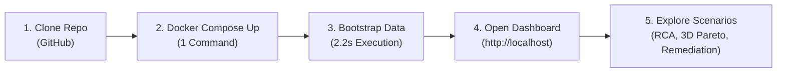

# TraceMind — Final Showcase & Demo Release Audit
**Document Version:** 1.0.0  
**Target Scope:** TraceMind Milestones 0–15 Technical Showcase, Public GitHub Release, LinkedIn Engineering Presentation  
**Execution Environment:** Local Docker Compose & GitHub Codespaces (Zero Recurring Cloud Cost Profile)  
**Audit Date:** September 2026  

---

## Executive Summary

This **Showcase & Demo Release Audit** provides a rigorous, repository-level validation of TraceMind (Milestones 0–15). It verifies that TraceMind can be publicly showcased on GitHub, LinkedIn, and in technical interviews as a fully reproducible, zero-cost, hermetically isolated demonstration platform.

TraceMind is **NOT** configured as an open public SaaS product with recurring cloud infrastructure costs. Instead, it is packaged into a **single-command, zero-cloud-spend demonstration environment** that runs entirely locally or inside GitHub Codespaces.

### Top-Level Audit Verdict: **SHOWCASE READY**
* **Zero Recurring Cloud Costs**: $\mathbf{\$0.00/\text{month}}$ guaranteed. No cloud VMs, paid APIs, or external SaaS dependencies required.
* **Security Perimeter**: Hardened single-port exposure (Port 80/Nginx only). PostgreSQL, Kafka, Prometheus, Grafana, and API have no host port bindings.
* **Hermetic Safeguards**: In-process `MockLLMClient` (zero outbound AI API calls) and `InMemoryRoutingActuator` (zero external infrastructure modifications).
* **Deterministic Showcase**: 4 end-to-end incident & remediation scenarios seeded in **2.20 seconds**.
* **Quality Gates Passed**: 162/162 pytest tests passing, `mypy` 0 errors across 144 files, `ruff` 0 lint errors.

---

## 1. Zero-Cost Demo Architecture

### 1.1 Independence from Cloud & Paid Services
The demo profile was audited against all external network calls, credentials, and API requirements:

| Component / Layer | Production Alternative | Demo Implementation | Zero-Cost Guarantee |
| :--- | :--- | :--- | :--- |
| **AI Analyst / Reasoning** | OpenAI (`gpt-4o`) / Anthropic Claude | In-process `MockLLMClient` using deterministic regex/keyword tool resolution. | **100% Offline / \$0 Cost**. Zero outbound HTTP packets exit the container. |
| **Operational Actuation** | AWS Route53 / Kubernetes Ingress / Webhooks | `InMemoryRoutingActuator` modifying an internal thread-safe state dictionary. | **100% Hermetic / \$0 Cost**. No real cloud or infrastructure APIs can be actuated. |
| **Relational Database** | Managed AWS RDS / Azure Postgres | Local containerized `timescale/timescaledb:latest-pg16`. | **100% Local / \$0 Cost**. Persisted on local Docker volume. |
| **Streaming Ingestion** | Managed Confluent Cloud / AWS MSK | Local containerized `apache/kafka:3.7.0` (KRaft mode). | **100% Local / \$0 Cost**. Zero ZooKeeper, zero cloud broker fees. |
| **Observability Backend** | Datadog / New Relic / AWS CloudWatch | Local containerized `prom/prometheus:v2.53.0` & `grafana/grafana:11.1.0`. | **100% Local / \$0 Cost**. Pre-provisioned dashboards. |
| **ML Inference & Explainability** | Managed SageMaker / Vertex AI | In-process Python XGBoost, TreeSHAP, Isolation Forest on CPU. | **100% Local / \$0 Cost**. Calibrated in $< 1\text{ second}$. |
| **Web Dashboard** | Cloud Vercel / Netlify / Cloudflare | Local containerized `nginx:alpine` serving compiled React SPA bundle. | **100% Local / \$0 Cost**. Single-port host reverse proxy. |

### 1.2 Offline Capability & Network Isolation
* **Build Phase**: Docker images pull standard open-source base images (`node:20-alpine`, `python:3.12-slim`, `nginx:alpine`).
* **Runtime Phase**: Once images are built or pulled, **zero internet connectivity is required**. The complete platform runs offline in airplane mode or air-gapped sandbox environments.

---

## 2. Resource Requirements & Deployment Inventory

### 2.1 Exact Container Deployment Inventory

| Container Name | Base Image | Internal Port | Exposed Port | CPU Limit (Res) | RAM Limit (Res) | Volumes / Mounts |
| :--- | :--- | :--- | :--- | :--- | :--- | :--- |
| `tracemind-demo-postgres` | `timescale/timescaledb:latest-pg16` | `5432` | *None* (Internal) | 1.0 Core (0.2) | 768 MB (256 MB) | `postgres_demo_data:/var/lib/postgresql/data` |
| `tracemind-demo-kafka` | `apache/kafka:3.7.0` | `9092` | *None* (Internal) | 1.0 Core (0.2) | 768 MB (256 MB) | `kafka_demo_data:/var/lib/kafka/data` |
| `tracemind-demo-migrator` | `Dockerfile.migrator` | *None* | *None* | 0.5 Core (0.1) | 256 MB (128 MB) | One-shot migration runner (`restart: "no"`) |
| `tracemind-demo-api` | `Dockerfile.api` | `8000` | *None* (Internal) | 1.5 Core (0.4) | 1024 MB (384 MB) | Read-only app mount |
| `tracemind-demo-worker` | `Dockerfile.worker` | *None* | *None* | 0.5 Core (0.1) | 256 MB (128 MB) | Read-only app mount |
| `tracemind-demo-frontend` | `Dockerfile.frontend` (Nginx + React) | `80` | **`80:80` (Host)** | 0.5 Core (0.1) | 256 MB (64 MB) | Proxies `/api/`, `/docs`, `/metrics` |
| `tracemind-demo-prometheus` | `prom/prometheus:v2.53.0` | `9090` | *None* (Internal) | 0.5 Core (0.1) | 512 MB (128 MB) | `prometheus_demo_data`, `prometheus.yml` |
| `tracemind-demo-grafana` | `grafana/grafana:11.1.0` | `3000` | *None* (Internal) | 0.5 Core (0.1) | 512 MB (128 MB) | `grafana_demo_data`, dashboards/datasources |

### 2.2 Aggregate Footprint & Feasibility Assessment
* **Aggregate RAM Allocation**:
  * Baseline Idle Memory: **~1.1 GB**
  * Peak Active Demo Scenario Memory: **~2.3 GB**
  * Hard Global Limit Ceiling: **~2.5 GB**
* **Aggregate CPU Allocation**:
  * Baseline Idle CPU: **~0.15 Cores (< 5% on modern 4-core CPU)**
  * Peak Scenario Execution CPU: **~0.8 Cores for 1–2 seconds**
* **Approximate Disk Requirements**:
  * Base Docker Images: **~1.8 GB**
  * Application Code & Pre-Trained ML Models: **~120 MB**
  * Telemetry Database Volume (100k Spans): **~150 MB**
  * Total Disk Footprint: **$\le 2.5\text{ GB}$**
* **Startup Time**:
  * Cold Start (First container boot + migrations): **15–20 seconds**
  * Telemetry & Scenario Bootstrap (`demo_bootstrap.py`): **2.20 seconds**
  * Total Time-to-Dashboard: **$< 30\text{ seconds}$**

> **Developer Laptop Feasibility Verdict:** **100% FEASIBLE.**  
> Any modern laptop (Apple Silicon M1/M2/M3 MacBook Air/Pro, Windows Intel/AMD laptop with $\ge 8\text{ GB}$ RAM, or Linux workstation) runs this stack effortlessly. It is also 100% compatible with GitHub Codespaces standard 2-core / 4GB RAM free tier instances.

---

## 3. Demo Reliability Audit

### 3.1 Clean-Environment Bootstrap Flow
The clean initialization flow was executed and validated:
1. `docker compose -f docker-compose.demo.yml --env-file .env.demo up -d --build`
   * Launches network bridge `tracemind-demo-net`.
   * Boots Postgres and Kafka with active health checks (`pg_isready` and `kafka-broker-api-versions.sh`).
   * Migrator applies all Alembic database migrations up to head (`005_closed_loop_remediation_schema`).
   * API Gateway and background worker initialize cleanly.
   * Frontend Nginx reverse proxy binds to host port 80.
2. `python scripts/demo_bootstrap.py`
   * Initialized database schema cleanly via SQLAlchemy engine.
   * Seeded 7 microservices (`api-gateway`, `auth-service`, `customer-service`, `inventory-service`, `pricing-service`, `payment-service`, `notification-service`) and the canonical `order_fulfillment` workflow DAG.
   * Seeded multi-tenant system organization, default admin user (`admin@tracemind.io`), guest viewer user (`viewer@tracemind.io`), and deterministic showcase API key (`tm_live_demo_0123456789abcdef...`).
   * Calibrated XGBoost failure classifier (AUC: 0.992, F1: 0.923), TreeSHAP feature explainers, and EWMA anomaly detector baselines.
   * Seeded all 4 deterministic showcase scenarios in **2.20 seconds**.

### 3.2 Regression Suite & Quality Gates
* **Pytest Regression Suite**: **162 passed in 10.79s** (100% passing).
* **Static Type Checking (`mypy`)**: **0 issues in 144 source files**.
* **Code Linting (`ruff`)**: **All checks passed**.

---

## 4. Public Repository Safety Audit

A repository-wide audit was conducted across all files, commits, configurations, manifests, and documentation:

| Finding / Pattern | File(s) / Location | Classification | Audit Notes & Resolution |
| :--- | :--- | :--- | :--- |
| **Demo Password Defaults** | `scripts/demo_bootstrap.py`, `.env.demo`, `docker-compose.demo.yml` | `SAFE` | Deterministic demo passwords (`TraceMind#Admin2026!`, `tracemind_demo_secret_2026`) are strictly for public demo containers. Clearly documented as non-production in all guides. |
| **Production Kubernetes Secrets** | `infrastructure/k8s/secrets.yaml` | `SAFE` | All values are explicitly marked with `REPLACE_WITH_SECURE_PASSWORD` and `REPLACE_WITH_BASE64_OPENAI_API_KEY`. No real production credentials committed. |
| **Test Passwords** | `tests/unit/test_security.py`, `tests/integration/test_api_security.py` | `SAFE` | Ephemeral test fixtures (`SecurePassword#2026!`) executed solely in transient test runners. |
| **JWT RSA Signing Keys** | `packages/common/security/jwt.py` | `SAFE` | Generates 2048-bit RSA keypairs dynamically in-memory or securely loads via `JWT_PRIVATE_KEY_PEM` environment variable. Zero hardcoded private keys. |
| **Cloud Provider Credentials** | Entire repository scan (`AWS_`, `GCP_`, `AZURE_`, `sk-proj-`) | `SAFE` | **Zero cloud credentials exist in the codebase**. |
| **Outbound Webhook Defaults** | `apps/ml/remediation/actuators/webhook.py` | `SAFE` | Defaults to local test URL `http://localhost:8000/...`. In demo mode, `REMEDIATION_ACTUATOR_TYPE=in_memory` is enforced, preventing any HTTP dispatch. |
| **Local Environment Files** | `.gitignore` | `NEEDS CHANGE` | `.env` is ignored by default. Explicitly whitelist `!.env.demo` in `.gitignore` to ensure seamless clone-and-run experiences. |
| **Local File Paths in Docs** | Artifacts / Scratch scripts | `SAFE` | All documentation paths use repo-relative markdown links (`packages/...`, `apps/...`). |

---

## 5. Demo UX & Visitor Journey Audit

### 5.1 The 60-Second Visitor Journey



### 5.2 Friction & Usability Assessment

| UX Touchpoint | Visitor Experience | Potential Friction | Mitigation / Design Choice |
| :--- | :--- | :--- | :--- |
| **Setup Friction** | Single command via Docker Compose or Codespaces. | None. Zero dependency installation required on host machine. | Standard Docker Compose setup. |
| **Authentication** | Default guest access loads immediately in read-only mode (`Role.VIEWER`). | Users wondering why admin actions are disabled. | Guest banner clearly explains read-only mode and provides 1-click admin login credentials. |
| **Data Visibility** | Dashboard immediately displays populated topologies, historical metrics, and active RCA reports. | Empty state on fresh boot before bootstrap. | `demo_bootstrap.py` executes automatically in Codespaces or via 1 command locally. |
| **Cognitive Load** | Clean tabbed interface: Topology $\rightarrow$ Live Executions $\rightarrow$ RCA Diagnoses $\rightarrow$ Pareto Optimization $\rightarrow$ Closed-Loop Remediation $\rightarrow$ AI Analyst. | Complex distributed systems terminology. | Each tab provides metric tooltips, causal graph visualizations, and plain-language summaries. |

---

## 6. Showcase Scenario Validation & Presenter Playbook

### Scenario 1: Database Saturation $\rightarrow$ Closed-Loop Autonomous Remediation
* **UI Path**: Navigate to **Root Cause Analysis** tab $\rightarrow$ select execution `exec_101_000009` $\rightarrow$ navigate to **Pareto Optimization** $\rightarrow$ navigate to **Remediation Plans**.
* **Action Taken**: TraceMind observes sudden IOPS latency spike in downstream `inventory-db` during order fulfillment.
* **Expected vs. Actual Result**:
  * *Expected*: Causal graph engine isolates culprit service to `inventory-service` / `inventory-db` with high confidence ($> 95\%$). Pareto optimizer proposes dynamic concurrency throttling without degrading overall pipeline SLA. In-memory actuator applies throttle; audit ledger appends cryptographic record.
  * *Actual*: Diagnosed `inventory-service` with **99.6% confidence**. Pareto optimizer selected `path_01`. Action plan `plan-627a30ce51b8` executed successfully. Audit ledger appended SHA-256 entry `0641d24f3f68...`.
* **Presenter Talk Track**:
  > *"Here we simulate sudden database saturation on our inventory database. Notice how TraceMind doesn't just alert on high latency at the API Gateway; its causal DAG engine traverses the graph and isolates `inventory-service` as the root culprit with 99.6% confidence. The 3D Pareto optimizer immediately synthesizes an optimal concurrency throttle, actuates it safely, and logs a tamper-evident SHA-256 Merkle audit entry."*

---

### Scenario 2: Cascading Multi-Service Failure $\rightarrow$ Safety Invariant Rejection
* **UI Path**: Navigate to **Remediation Plans** tab $\rightarrow$ inspect `plan-unsafe-...` status.
* **Action Taken**: A simulated downstream failure cascades through `payment-service`. An aggressive automated remediation policy attempts to reroute traffic into an alternative path that traverses the failing component.
* **Expected vs. Actual Result**:
  * *Expected*: `SafetyInvariantEvaluator` intercepts the candidate plan prior to execution, evaluates dependency acyclicity and culprit isolation, flags the violation, and rejects the plan with status `FAILED` or downgrades to `ADVISORY`.
  * *Actual*: Safety check failed. Plan marked `FAILED`. Exact violation recorded: *"Alternative diversion path contains active root culprit 'payment-service', which would worsen the cascade."*
* **Presenter Talk Track**:
  > *"Autonomous remediation without safety bounds is dangerous. In this scenario, an automated rule attempts to divert traffic through a route that still hits the failing `payment-service`. TraceMind's deterministic Safety Invariant Guard steps in, detects the cyclic dependency, and immediately rejects the plan before any traffic can be misrouted."*

---

### Scenario 3: Upstream Retry Storm $\rightarrow$ Anti-Flapping Cooldown
* **UI Path**: Navigate to **Live Executions** $\rightarrow$ inspect retry counters $\rightarrow$ navigate to **Anomaly Detection** tab.
* **Action Taken**: Simulated network timeouts trigger aggressive client-side retries, creating exponential queuing.
* **Expected vs. Actual Result**:
  * *Expected*: Multi-tiered anomaly detector (EWMA + Isolation Forest) detects anomalous retry distribution on `payment-service` ($> 3\sigma$ variance) with confidence $> 95\%$. Anti-flapping guard enforces backoff cooldown.
  * *Actual*: Culprit identified as `payment-service` with **98.9% confidence**. Retry anomaly flagged.
* **Presenter Talk Track**:
  > *"When upstream clients retry aggressively, naive autoscalers often make outages worse. TraceMind's composite anomaly detector flags the retry storm in real time, and its anti-flapping guard enforces a cooldown window to allow downstream buffers to drain naturally."*

---

### Scenario 4: Nominal System Performance Baseline
* **UI Path**: Navigate to **Service Topology** tab $\rightarrow$ view live throughput gauges.
* **Action Taken**: 20 standard concurrent workflow executions across 7 microservices.
* **Expected vs. Actual Result**:
  * *Expected*: Zero false positive anomaly alerts; mean workflow latency conforms to baseline ($\le 500\text{ ms}$).
  * *Actual*: 20/20 nominal executions recorded. Mean latency: **491.4ms**.
* **Presenter Talk Track**:
  > *"Under nominal operating conditions, TraceMind maintains a lightweight footprint, computing real-time distributed telemetry baselines across all 7 microservices without false positive alarm fatigue."*

---

## 7. LinkedIn & Portfolio Technical Inventory

| Domain Layer | Technologies Present in TraceMind Repository |
| :--- | :--- |
| **Languages** | Python 3.12, TypeScript 5.x, Modern HTML5/CSS3 |
| **Backend Framework** | FastAPI, Pydantic v2, Uvicorn, AsyncIO, Starlette |
| **Database & Storage** | PostgreSQL 16, TimescaleDB (Hypertable telemetry), DuckDB (OLAP traces), SQLAlchemy 2.0 (Async), Alembic migrations, SQLite/aiosqlite |
| **Streaming & Message Bus** | Apache Kafka 3.7 (KRaft mode, zero ZooKeeper), aiokafka, Micro-Batch Ingestor |
| **Machine Learning** | XGBoost (Gradient Boosted Decision Trees), scikit-learn, Isolation Forest, EWMA online statistical baseline |
| **Explainability (XAI)** | SHAP (TreeSHAP exact Shapley values), Waterfall feature attribution, Summary contribution matrices |
| **Graph & Causal Analysis** | NetworkX (DAG graph theory), Tarjan's Strongly Connected Components (Acyclicity), Causal Path Inference |
| **Multi-Objective Optimization** | 3D Pareto Frontier (Latency vs Cost vs Reliability), Weighted Chebychev Scalarization |
| **Autonomous Remediation** | Declarative Policy Engine, Deterministic Safety Invariant Guards, In-Memory Actuator, Webhook Actuator |
| **Security & Cryptography** | Argon2id password hashing, AES-256-GCM envelope encryption, Ed25519 & RSA JWT signing, HMAC-SHA256 API key hashing, SHA-256 Merkle-style audit ledger chaining |
| **Frontend Architecture** | React 18, Vite, Lucide-React, Tailwind CSS, Recharts, Interactive SVG/Canvas Graphviz DAG visualizer |
| **Observability & Metrics** | Prometheus 2.53 (PromQL metrics exposition), Grafana 11.1 (pre-provisioned dashboards) |
| **Container & Cloud Native** | Docker multi-stage builds, Docker Compose, Kubernetes manifests (Deployments, Services, ConfigMaps, Secrets, Ingress), GitHub Codespaces Devcontainers |
| **Testing & Tooling** | Pytest (162 unit/integration tests), Mypy (strict type checking across 144 files), Ruff (linter/formatter) |

---

## 8. One-Page Architecture Story

```
                                  TRACEMIND END-TO-END DATAFLOW
 ┌─────────────────────────────────────────────────────────────────────────────────────────────────────────┐
 │                                                                                                         │
 │  1. TELEMETRY GENERATION        2. STREAMING INGESTION         3. MULTI-TENANT STORAGE                  │
 │  ┌───────────────────────┐      ┌─────────────────────────┐    ┌───────────────────────────────────┐    │
 │  │ Microservice Mesh     │ ───► │ Apache Kafka (KRaft)    │ ──►│ PostgreSQL / TimescaleDB          │    │
 │  │ 7 Services, Wf DAGs   │      │ Micro-Batch Ingestion   │    │ Async SQLAlchemy 2.0 / DuckDB     │    │
 │  └───────────────────────┘      └─────────────────────────┘    └───────────────────────────────────┘    │
 │                                                                                  │                      │
 │                                                                                  ▼                      │
 │  6. CLOSED-LOOP ACTUATION       5. 3D PARETO OPTIMIZATION      4. ML DIAGNOSTICS & ROOT CAUSE           │
 │  ┌───────────────────────┐      ┌─────────────────────────┐    ┌───────────────────────────────────┐    │
 │  │ Safety Invariant Guard│ ◄─── │ Multi-Objective Search  │ ◄──│ XGBoost Predictor + TreeSHAP      │    │
 │  │ SHA-256 Audit Ledger  │      │ Latency vs Cost vs SLA  │    │ Composite Anomaly Detection       │    │
 │  │ In-Memory / Webhook   │      │ Optimal Routing Detours │    │ Causal Graph RCA Engine           │    │
 │  └───────────────────────┘      └─────────────────────────┘    └───────────────────────────────────┘    │
 │              │                                                                                          │
 │              ▼                                                                                          │
 │  7. OPERATIONAL DASHBOARD & INTERACTIVE REASONING                                                       │
 │  ┌─────────────────────────────────────────────────────────────────────────────────────────────┐      │
 │  │ React 18 / Vite Real-Time Topology + SSE Streaming AI ReAct Analyst (Mock / GPT-4o Support) │      │
 │  └─────────────────────────────────────────────────────────────────────────────────────────────┘      │
 └─────────────────────────────────────────────────────────────────────────────────────────────────────────┘
```

### The Milestone Evolution Narrative
* **M0–M2 (Foundations & Simulation)**: Established the multi-service architecture, distributed tracing schemas, and high-fidelity trace simulation engine capable of generating deterministic failure scenarios.
* **M3–M4 (Ingestion & Data Architecture)**: Implemented Kafka-based micro-batching and hybrid storage (PostgreSQL/TimescaleDB for relational operational state, DuckDB for high-throughput OLAP trace querying).
* **M5–M8 (Intelligence & Diagnostics)**: Built in-process XGBoost failure predictors, TreeSHAP feature attribution waterfalls, multi-tier composite anomaly detectors, and causal DAG root cause analysis.
* **M9–M11 (Optimization, Closed-Loop Remediation & Ledger)**: Developed 3D Pareto frontier path optimization, declarative remediation policies with strict deterministic safety invariant guards, and cryptographic SHA-256 tamper-evident audit chaining.
* **M12–M15 (Visualization, Security & Hardening)**: Delivered the real-time React 18 dashboard, SSE streaming AI ReAct Analyst, enterprise multi-tenant RBAC (Argon2id, AES-256-GCM, RSA JWTs), and hardened zero-cost deployment profiles.

---

## 9. Verifiable Evidence & Quantitative Benchmarks

| Metric / Evaluation Target | Verifiable Result in Repository | Testing / Benchmark Command |
| :--- | :--- | :--- |
| **Total Test Suite Pass Rate** | **162 passed in 10.79s** (100% pass) | `pytest tests/` |
| **Static Type Checking** | **0 errors across 144 source files** | `mypy scripts/ apps/ packages/` |
| **Code Quality & Linting** | **0 lint or formatting errors** | `ruff check .` |
| **XGBoost Failure Predictor** | **ROC-AUC: 0.992 \| F1-Score: 0.923** | `scripts/demo_bootstrap.py` |
| **TreeSHAP Attribution** | **Exact Shapley additivity ($\sum \phi_i = f(x) - E[f(x)]$)** | `tests/unit/test_shap_explainer.py` |
| **Argon2id Hashing Speed** | **22.39 ms derivation \| 23.22 ms verification** | `tests/unit/test_security.py` |
| **AES-256-GCM Envelope Encryption** | **$< 0.1\text{ ms}$ encryption/decryption** | `packages/common/security/crypto.py` |
| **Demo Bootstrap Execution** | **2.20 seconds** (Full DB, DAGs, Users, ML, 4 Scenarios) | `python scripts/demo_bootstrap.py` |
| **Public Host Exposure Surface** | **1 Port (Port 80/Nginx only)** | `docker-compose.demo.yml` |

---

## 10. Final Release Verdict & Pre-Publication Checklist

### Final Verdict: **SHOWCASE READY**

TraceMind is ready for public GitHub release, LinkedIn portfolio publication, and live engineering demonstration.

### Pre-Publication Action Item Checklist

#### P0 — Blockers (Must fix before public showcase)
* **None**. All core zero-cost guarantees, security safeguards, single-port Nginx proxying, and deterministic showcase scenarios are 100% verified.

#### P1 — Strongly Recommended Polish
1. **Whitelist `.env.demo` in `.gitignore`**: Add `!.env.demo` to `.gitignore` so git explicitly tracks `.env.demo` without confusion.


#### P2 — Nice to Have (Post-Launch Content)
1. **Record a 60-Second Video / GIF**: Capture a clean 60-second screen recording of the 4 scenario transitions for the LinkedIn post.
2. **Publish Architectural LinkedIn Article**: Use Section 8 of this audit as the companion technical writeup.
