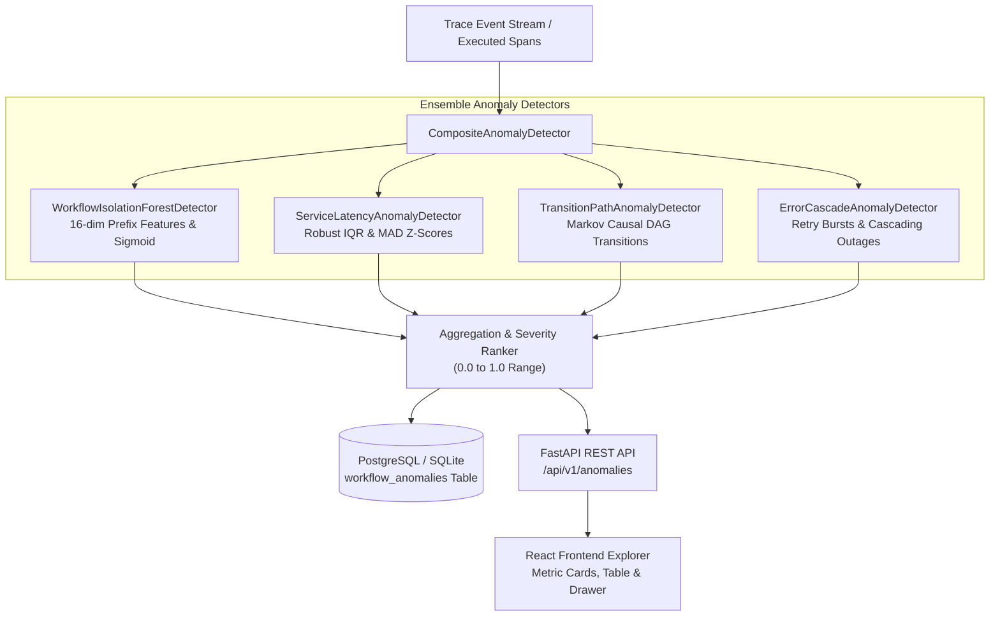

# TraceMind — Unsupervised Anomaly Detection Engine Architecture

## 1. System Overview

The **Unsupervised Anomaly Detection Engine** (Milestone 7) provides real-time in-flight and post-execution outlier detection for distributed workflow executions. It combines four complementary detection paradigms:

1. **Workflow-Level Multidimensional Outlier Detection (`WorkflowIsolationForestDetector`)**:
   Unsupervised Isolation Forest over 16-dimensional prefix feature vectors identifying anomalous resource consumption, extreme durations, or non-linear telemetry patterns without supervision.
2. **Microservice Latency Anomaly Detection (`ServiceLatencyAnomalyDetector`)**:
   Dynamic statistical outlier detection computing robust Interquartile Ranges ($\text{IQR} = Q_3 - Q_1$) and Median Absolute Deviations ($\text{MAD}$) per microservice, resilient to heavy-tailed log-normal distributions.
3. **Markov DAG Sequence & Transition Anomaly Detection (`TransitionPathAnomalyDetector`)**:
   Empirical causal edge transition model $P(v \mid u)$ identifying rare service hops, missing mandatory pipeline stages, illegal DAG transitions, and circular dependency loops.
4. **Error Cascade & Retry Storm Detection (`ErrorCascadeAnomalyDetector`)**:
   Temporal failure correlation engine detecting rapid retry bursts ($\ge 3$ retries) and downstream cascading fault propagation ($\ge 2$ failing services within $\tau \le 1200\text{ms}$).

---

## 2. Multi-Detector Architecture

## 3. Mathematical Formulations & Calibration

### 3.1 Robust Latency Outlier Detection
For each microservice $s$, empirical quartiles $Q_1(s), Q_3(s)$ and median $M(s)$ are computed on nominal executions:
$$\text{IQR}(s) = Q_3(s) - Q_1(s)$$
$$\text{Upper Threshold}(s) = \max\left(M(s) + 150\text{ms}, Q_3(s) + 3.5 \times \text{IQR}(s)\right)$$
An event latency $x$ is flagged if $x > \text{Upper Threshold}(s)$ and the robust Z-score exceeds $3.5$:
$$z = \frac{x - \mu(s)}{\sigma(s)} \ge 3.5$$

### 3.2 Markov Transition Path Modeling
Given directed transitions between services $(u \to v)$, empirical conditional probabilities are computed:
$$P(v \mid u) = \frac{C(u, v)}{\sum_{w} C(u, w)}$$
A transition edge is flagged as an illegal or anomalous path if $P(v \mid u) < \alpha$ (default $\alpha = 0.02$). Path anomalousness is scored using Negative Log-Likelihood (NLL):
$$\text{NLL} = -\frac{1}{N} \sum_{i=1}^N \ln P(v_i \mid u_i)$$
$$\text{Score} = 1.0 - \exp\left(-0.4 \times \text{NLL}\right) \in [0.0, 1.0]$$

### 3.3 Isolation Forest Calibration
Raw decision function output $f(x) \in (-\infty, +\infty)$ where higher values indicate more isolated outliers is calibrated against the empirical 98th percentile baseline threshold $\theta_{98}$:
$$\text{Score}_{\text{IF}}(x) = \frac{1}{1 + \exp\left(-12.0 \times (f(x) - \theta_{98})\right)} \in [0.0, 1.0]$$

---

## 4. Database Persistence Schema

The `workflow_anomalies` table records all detected anomalies with complete causal evidence:

| Column | Type | Description |
| :--- | :--- | :--- |
| `id` | `VARCHAR(64)` (PK) | Unique anomaly ID (`anom_<hex>`) |
| `execution_id` | `VARCHAR(64)` (FK) | Reference to workflow execution |
| `workflow_definition_id` | `VARCHAR(64)` | Workflow DAG identifier |
| `anomaly_type` | `VARCHAR(64)` | `LATENCY_SPIKE`, `UNUSUAL_PATH`, `RETRY_STORM`, `ERROR_CASCADE`, etc. |
| `score` | `FLOAT` | Calibrated severity score $[0.0, 1.0]$ |
| `severity` | `VARCHAR(16)` | `INFO` ($<0.4$), `WARNING` ($0.4-0.7$), `CRITICAL` ($\ge 0.7$) |
| `affected_services` | `JSON` | Array of impacted microservices |
| `explanation` | `TEXT` | Human-readable explanation |
| `evidence` | `JSON` | Quantitative diagnostic metrics and baseline stats |
| `detected_at` | `TIMESTAMP WITH TIME ZONE` | UTC timestamp of detection |

---

## 5. REST API Endpoints

- `POST /api/v1/anomalies/detect`: Evaluates raw trace spans in-flight or post-execution; optional async database persistence.
- `GET /api/v1/anomalies`: Multi-filter paginated list (filter by `workflow_definition_id`, `anomaly_type`, `severity`, `min_score`).
- `GET /api/v1/anomalies/stats`: Aggregated summary breakdown by anomaly type, severity distribution, and top affected services.
- `GET /api/v1/anomalies/executions/{execution_id}`: Retrieves all anomalies detected within a specific workflow run.
- `GET /api/v1/anomalies/{anomaly_id}`: Retrieves detailed evidence payload for a specific anomaly record.
- `POST /api/v1/anomalies/fit`: Retrains and calibrates empirical baseline distributions across nominal executions.

---

## 6. Performance & Quality Profile

- **Detection Recall Across 7 Chaos Presets**: **100.0% (210/210 detected)**
- **False Positive Rate on Nominal Workflows**: **3.0% FPR** ($< 5.0\%$ target)
- **Throughput**: **423.6 detections/sec**
- **Single-Execution Latency**:
  - **P50**: **2.22 ms**
  - **P90**: **2.80 ms**
  - **P95**: **3.26 ms**
  - **P99**: **4.50 ms** ($< 10.0\text{ ms}$ target)
  - **Mean**: **2.36 ms**
- **Backend Test Suite**: **74/74 tests passing**
- **Mypy Static Type Checking**: **0 errors across 114 source files**
- **Ruff Linting / Formatting**: **0 errors / 139 files formatted**
- **Frontend TypeScript / Build**: **0 errors / Vite build in 3.99s**
