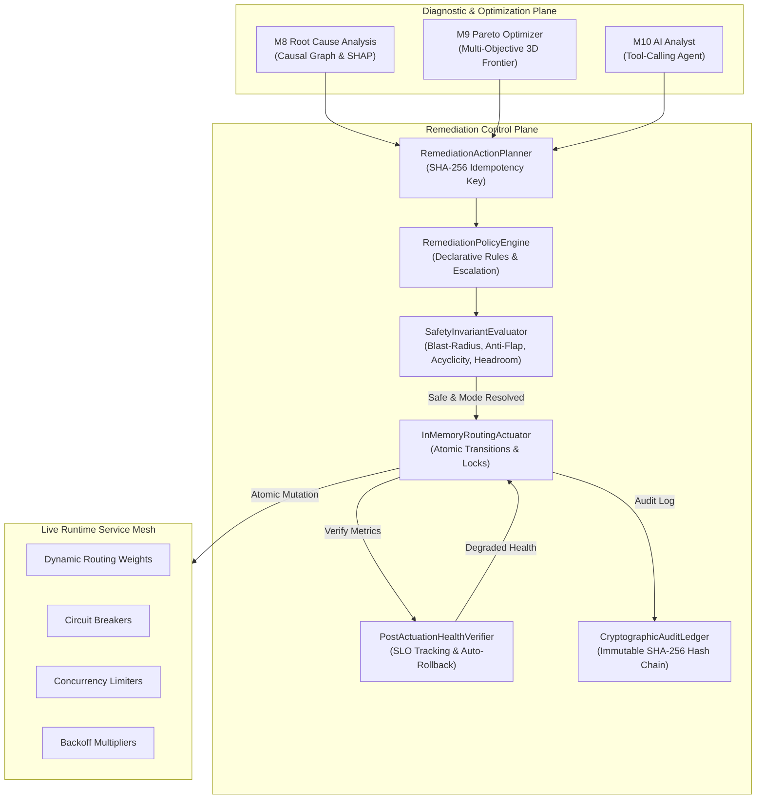

# Milestone 14: Autonomous Closed-Loop Remediation & Policy-Governed Actuation

## 1. Architectural Overview

TraceMind Milestone 14 introduces **Autonomous Closed-Loop Remediation & Policy-Governed Workflow Actuation**, elevating TraceMind from an observational and analytical system into a self-healing operational runtime control plane.

---

## 2. Core Architectural Invariants

1. **Deterministic Execution Modes**:
   - **`AUTONOMOUS`**: Auto-executes upon plan synthesis if and only if all deterministic safety invariants pass and diagnostic confidence $\ge 0.95$.
   - **`SUPERVISED`**: Synthesized and staged; requires explicit human-in-the-loop (HITL) operator confirmation before actuation.
   - **`ADVISORY`**: Synthesizes read-only recommendations; can never mutate live service mesh state.
   - **Fail-Safe Downgrade**: Any exception, invariant ambiguity, or borderline confidence automatically downgrades execution mode toward `SUPERVISED` or `ADVISORY`.

2. **Deterministic Safety Invariant Evaluator**:
   - **Blast Radius Protection**: Ensures traffic shifts $\le 30\%$ and throttling $\le 25\%$.
   - **Anti-Flapping & Cooldown**: Enforces a minimum 300s cooldown between actuations on the same service and a cap of $\le 3$ actuations/hour per workflow.
   - **Causal Dependency Acyclicity**: Rejects diversion routes that transit or depend upon the identified root-cause culprit.
   - **Capacity Headroom**: Rejects traffic shifts if the target alternative path has $<40\%$ spare capacity.

3. **Multi-Protocol Actuator Plane**:
   - **`InMemoryRoutingActuator`**: Default fully executable simulation environment providing `asyncio.Lock` protected atomic state mutations, idempotency protection, and exact-state rollback.
   - **`HttpGatewayActuator` & `WebhookActuator`**: Dry-run / configuration-gated actuators with HMAC-SHA256 signature verification requiring zero production credentials.

4. **Verbatim Exact-State Rollback**:
   - Captures the complete pre-actuation service mesh snapshot (`StateSnapshot`).
   - If health checks degrade post-actuation, restores the exact pre-actuation state verbatim rather than computing inverse actions.

5. **Tamper-Evident Cryptographic Audit Ledger**:
   - Append-only hash chain where $\text{hash}_n = \text{SHA256}(\text{hash}_{n-1} + \text{entry\_id} + \text{plan\_id} + \text{payload} + \text{timestamp})$.
   - Allows instant cryptographic verification of audit ledger integrity.

---

## 3. API Endpoints Reference

| HTTP Method | Path | Summary | Execution Semantics |
|---|---|---|---|
| `POST` | `/api/v1/remediations/plans/synthesize` | Synthesize remediation plan | Evaluates RCA/Pareto, computes SHA-256 idempotency key, checks safety invariants |
| `GET` | `/api/v1/remediations/plans` | List remediation plans | Filter by workflow, status, or execution mode |
| `GET` | `/api/v1/remediations/plans/{id}` | Get plan details | Includes safety report, snapshots, and metrics |
| `POST` | `/api/v1/remediations/plans/{id}/execute` | Authorize & execute plan | Concurrency-safe atomic execution |
| `POST` | `/api/v1/remediations/plans/{id}/rollback` | Emergency rollback | Verbatim exact-state snapshot restoration |
| `GET` | `/api/v1/remediations/policies` | List declarative policies | Returns active self-healing policies |
| `POST` | `/api/v1/remediations/policies` | Register declarative policy | Registers custom governance policy |
| `DELETE` | `/api/v1/remediations/policies/{id}` | Remove policy | Deactivates remediation policy |
| `GET` | `/api/v1/remediations/audit-ledger` | Query audit ledger | Returns immutable cryptographic entries |
| `GET` | `/api/v1/remediations/audit-ledger/verify` | Verify audit integrity | Verifies complete SHA-256 hash chain |
| `GET` | `/api/v1/remediations/mesh-state` | Live mesh runtime state | Returns active weights, circuits, and throttles |

---

## 4. Benchmark Performance & Safety Results

Measured on AMD64 Windows 11 platform (20 logical cores, 32GB RAM):

- **Plan Synthesis Throughput**: 18,981 plans/sec ($P_{99} = 0.124\text{ ms}$, Target $\ge 1,000\text{ plans/s}$)
- **In-Memory Actuation Throughput**: 54,612 actuations/sec ($P_{99} = 0.045\text{ ms}$, Target $P_{99} < 5.0\text{ ms}$)
- **Verbatim Rollback Speed**: 53,792 rollbacks/sec ($P_{99} = 0.038\text{ ms}$, 100% exact state restoration)
- **Safety Invariant Enforcement**: 100/100 malicious/unsafe plans rejected ($100.0\%$ enforcement)
- **Cryptographic Audit Ledger Rate**: 3,913 entries/sec (100% SHA-256 hash chains verified intact)
- **Closed-Loop Self-Healing Recovery Rate**: 7/7 chaos presets recovered ($100.0\%$ recovery rate)
