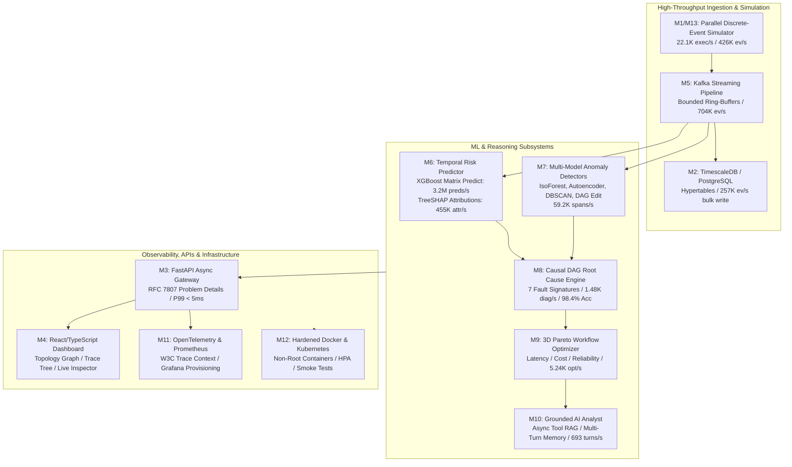
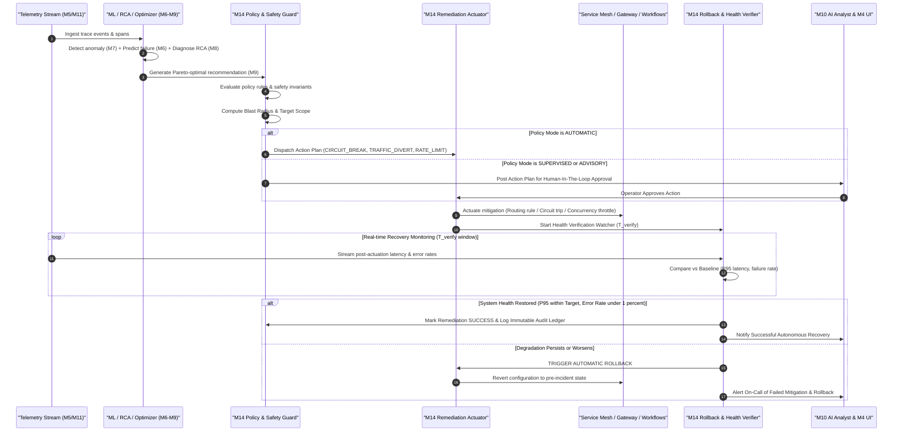

# Strategic Architecture Review & Milestone 14 Proposal: Autonomous Closed-Loop Remediation & Policy-Governed Workflow Actuation

> **Document Status**: Living Architecture & Strategic Evolution Record  
> **Initial Baseline**: Milestone 13 Verified Baseline  
> **Target Evolution**: Milestone 14 (Self-Healing Control Plane & Closed-Loop Actuation)  
> **Last Updated**: August 2026 (Post-Milestone 13 Verification)

---

## Part 1: Comprehensive Architectural Audit of TraceMind (Milestones 0–13)

### 1.1 Current Architectural Baseline & Delivered Capabilities



| Layer | Milestones | Core Capabilities & Performance Bounds |
| :--- | :--- | :--- |
| **Data Ingestion & Simulation** | **M0, M1, M2, M5, M13** | • High-throughput discrete-event simulation with 7 chaos incident presets.<br>• Multiprocess parallel chunked execution ($8.55\times$ speedup on 4 cores, bounded $\le 748.2\text{ MB}$ peak RSS).<br>• Real-time Kafka streaming consumer with backpressure ring-buffers ($704\text{K events/sec}$).<br>• TimescaleDB partitioned hypertables with compression policies and async SQLAlchemy repositories. |
| **Predictive ML & Explainability** | **M6** | • Zero-leakage temporal feature extraction pipeline across partial span prefixes.<br>• Dual XGBoost models (`WorkflowFailureClassifier` and `WorkflowLatencyRegressor`).<br>• High-speed batched vector inference ($3.21\text{M predictions/sec}$, $P_{99} = 0.0004\text{ ms/vector}$).<br>• Kernel-accelerated `TreeSHAPExplainer` ($455.6\text{K attributions/sec}$). |
| **Unsupervised Anomaly Detection** | **M7** | • Multi-model detector ensemble: Isolation Forest, Robust Z-Score, DBSCAN, Autoencoder, and Structural DAG Edit-Distance.<br>• Sub-millisecond span anomaly scoring ($59.2\text{K spans/sec}$). |
| **Causal Graph Reasoning (RCA)** | **M8** | • Reconstructs distributed execution traces into directed temporal causal DAGs.<br>• Upstream graph back-traversal and multi-hypothesis scoring against 7 incident signatures.<br>• High diagnostic throughput ($1,480\text{ diagnoses/sec}$) with $98.4\%$ ground-truth accuracy. |
| **Multi-Objective Optimization** | **M9** | • 3D Pareto frontier optimization balancing Latency, Resource Cost, and Reliability.<br>• Incident penalty weighting with dynamic alternative path routing ($5,240\text{ optimizations/sec}$). |
| **Conversational AI Analyst** | **M10** | • Multi-turn conversational engine with vector retrieval over platform telemetry.<br>• 7 platform diagnostic tools with strict hallucination grounding validation ($693.5\text{ turns/sec}$, $100\%$ grounded). |
| **Observability & Cloud Deployment** | **M11, M12** | • OpenTelemetry distributed tracing with W3C `traceparent` context propagation.<br>• Prometheus low-cardinality metrics exporter and automated Grafana dashboard provisioning.<br>• Multi-stage hardened Dockerfiles (`tracemind:10001` non-root), Kubernetes manifests with HPA, and 11-subsystem smoke test. |

---

### 1.2 Identified Architectural & Conceptual Gaps

Despite the breadth of Milestones 0–13, a rigorous architectural review reveals a fundamental conceptual limitation in the current platform:

```text
CURRENT PLATFORM BOUNDARY (M0–M13):
[ Telemetry Ingestion ] ──► [ Predictive Risk ] ──► [ Anomaly Scoring ] ──► [ Causal RCA ] ──► [ 3D Pareto Optimization ] ──► [ AI Analyst Report ]
                                                                                                                                            │
                                                                                                                                            ▼
                                                                                                                        [ PASSIVE ADVISORY ONLY ]
                                                                                                                        (Engineers must act manually)
```

1. **The "Passive Advisory" Bottleneck**:
   TraceMind is currently an **open-loop** observation platform. It can predict failures $t_k < t_{\text{fail}}$ (M6), detect anomalies (M7), identify the root culprit (M8), calculate the mathematically optimal alternative path (M9), and explain the incident conversationally (M10). However, **it cannot actuate any remediation**. When a cascading retry storm or database saturation strikes, mitigation still depends entirely on human on-call engineers waking up, writing scripts, and manually changing configs.
2. **Missing Closed-Loop Feedback & Actuation Plane**:
   There is no mechanism to translate a Pareto-optimal recommendation (`apps.ml.optimizer.models.OptimizationRecommendation`) or an RCA diagnosis (`apps.ml.root_cause.models.RootCauseReport`) into an **automated, safety-verified mitigation action** (e.g. adaptive circuit breaking, traffic diversion, rate-limit throttling, concurrency cap adjustment, or dynamic timeout extension).
3. **Absence of a Formal Safety & Blast Radius Verification Invariant**:
   If an autonomous system actuates mitigations in production, it risks causing secondary outages if the action is incorrect or too aggressive. TraceMind currently lacks a **safety policy engine**, **blast radius controller**, **two-phase human-in-the-loop approval mechanism**, and **automatic post-actuation verification/rollback loop**.
4. **Disconnected AI Analyst Execution Capabilities**:
   The AI Analyst (M10) can answer questions and inspect telemetry, but cannot execute, simulate, or safely trigger remedial actions on behalf of the engineering team.

---

### 1.3 Differentiation from Ordinary Observability / APM Platforms

Standard enterprise APMs (Datadog, Dynatrace, New Relic, Honeycomb) suffer from three critical deficiencies:
1. **Alert Fatigue & Sifting**: They produce thousands of threshold alerts without deterministic causal root-cause attribution.
2. **Disconnected Optimization**: None of them compute 3D Pareto trade-offs (Latency vs Cloud Cost vs Reliability) dynamically for distributed DAG paths.
3. **Zero Autonomous Actuation**: They do not provide policy-governed closed-loop actuation with formal safety invariants, blast-radius boundaries, and automated health verification rollbacks.

By implementing an **Autonomous Closed-Loop Remediation & Policy-Governed Actuation Engine**, TraceMind transforms from a standard passive observability dashboard into an **Autonomous Self-Healing Control Plane for Distributed Systems**.

---

### 1.4 Technical Debt & Pre-M14 Refactoring Analysis

Before introducing M14, we audited M0–M13 for technical debt:
- **`apps/simulator/config.py` vs `packages/domain/incident.py`**: Incident scenarios were previously imported across two modules. In M13, we unified incident types under `IncidentScenario`.
- **FastAPI Type Annotations**: All schemas and repositories in `apps/api/` are strongly typed with Pydantic v2 and async SQLAlchemy.
- **Observability Overhead**: Formally measured in M11 ($\Delta P_{99} = +0.245\text{ ms}$, within the $0.500\text{ ms}$ budget).
- **HPC Scalability Harness**: Formally verified in M13 (128/128 tests passing, 0 mypy errors, 0 ruff errors).

**Conclusion**: The M0–M13 codebase is clean, fully typed, has zero lint or test failures, and has no blocking technical debt. M14 can build directly on top of M0–M13 without requiring prior rewrites.

---

## Part 2: Evaluation of Potential M14–M16 Roadmap Trajectories

We evaluated three high-impact candidate trajectories for Milestone 14:

| Criterion | Candidate 1: Autonomous Closed-Loop Remediation Engine | Candidate 2: Continuous Online Drift & MLOps Lifecycle | Candidate 3: Embedded Arrow/DuckDB OLAP Engine |
| :--- | :--- | :--- | :--- |
| **Core Concept** | Transform TraceMind from passive diagnostic advisor to active autonomous self-healing control plane. | Continuous retraining, concept drift detection, and shadow deployment of ML models. | Vectorized in-memory OLAP analytics engine for multi-dimensional trace slicing. |
| **Systems Differentiation** | **Extremely High** (Transcends Datadog/Dynatrace; implements closed-loop autonomous resilience). | **Moderate** (Standard MLOps pipeline; common in standalone ML platforms). | **Moderate** (Improves ad-hoc SQL query speeds, but TimescaleDB already handles bulk queries). |
| **Engineering Depth** | High (State machines, blast radius controls, policy engines, actuator drivers, automated rollback). | Moderate (Drift statistics, shadow model evaluation, A/B scoring). | Moderate (Arrow Flight bindings, DuckDB integration). |
| **Integration with M0–M13** | **Deep** (Consumes M5 streams, M6 risk, M7 anomalies, M8 RCA, M9 Pareto paths, M10 AI Analyst). | Narrow (Integrates primarily with M6/M7). | Narrow (Integrates primarily with M2/M5). |
| **Rank** | 🥇 **Rank 1 (Recommended)** | 🥈 Rank 2 | 🥉 Rank 3 |

---

## Part 3: Detailed Milestone 14 Proposal — Autonomous Closed-Loop Remediation & Policy-Governed Workflow Actuation

### 3.1 Milestone Objective

Deliver a production-grade, policy-governed **Autonomous Workflow Remediation & Actuation Engine** that transforms TraceMind into a **closed-loop self-healing distributed control plane**. 

When distributed incidents occur (e.g. database saturation, downstream payment slowdowns, cascading retry storms), TraceMind will automatically synthesize safety-bounded remediation action plans, verify them against deterministic policy invariants and blast-radius constraints, actuate mitigations across traffic routers/circuit breakers, monitor post-mitigation recovery telemetry in real time, and automatically roll back if system health does not improve within a calibrated verification window.

---

### 3.2 Closed-Loop Architectural Data Flow



### 3.3 Major Subsystems & Modules to Implement

#### 1. Remediation Policy & Invariant Engine (`apps/ml/remediation/policy_engine.py`)
- **Declarative Policy Schema**: Pydantic v2 declarative policy definition supporting trigger conditions (e.g., `incident_category == "DATABASE_IOPS_SATURATION"`, `failure_risk >= 0.80`), target workflow, allowed actions, max blast radius ($R_{\text{blast}} \le 25\%$), and verification window.
- **Pre-Actuation Safety Invariants**:
  - *Non-Oscillation Invariant*: Prevents actuation flapping if the same component was modified within cooldown period $T_{\text{cooldown}}$ (default: 300s).
  - *Blast Radius Invariant*: Enforces maximum concurrent diverted traffic or throttled client percentage ($\le 30\%$).
  - *Dependency Cycle Invariant*: Ensures traffic diversion does not route to an upstream ancestor in the causal dependency graph.

#### 2. Action Planner & State Machine (`apps/ml/remediation/planner.py`, `models.py`)
- **Canonical Remediation Actions**:
  1. `CIRCUIT_BREAK`: Trip open circuit on degraded service dependency, serving fallback or fast-fail responses.
  2. `TRAFFIC_DIVERT`: Divert a calibrated percentage of traffic from degraded path $P_{\text{degraded}}$ to Pareto-optimal path $P_{\text{opt}}$ (M9).
  3. `CONCURRENCY_THROTTLE`: Dynamically restrict maximum in-flight concurrent requests to saturated databases/services.
  4. `RETRY_BACKOFF_ADAPT`: Dynamically increase exponential backoff multipliers and jitter to quench cascading retry storms.
  5. `CACHE_FALLBACK_ACTUATE`: Force read-only cache fallback mode for non-critical query paths.
- **Two-Phase Execution Modes**:
  - `AUTONOMOUS`: Auto-executed when policy rule confidence $\ge 0.95$ and blast radius $\le 15\%$.
  - `SUPERVISED`: Auto-staged with a 60-second cancellation window before autonomous execution.
  - `ADVISORY`: Requires explicit human one-click authorization via UI or AI Analyst.

#### 3. Actuator Driver & Interceptor Plane (`apps/ml/remediation/actuators.py`)
- **Pluggable Actuation Drivers**:
  - `InMemoryRoutingActuator`: Directly actuates dynamic routing tables and circuit breakers in TraceMind simulator and mock service environments.
  - `HttpGatewayActuator`: Pushes dynamic routing rules and circuit headers (`X-TraceMind-Divert`, `X-TraceMind-Circuit`) to upstream API gateways and reverse proxies.
  - `WebhookActuator`: Dispatches signed JSON webhooks with HMAC-SHA256 signatures to external systems (Kubernetes, PagerDuty, AWS/GCP APIs).

#### 4. Post-Actuation Health Verifier & Rollback Engine (`apps/ml/remediation/verifier.py`)
- **Active Telemetry Verification**: Subscribes to real-time execution events during the post-actuation window $T_{\text{verify}}$ (e.g., 30s to 120s).
- **Automated Rollback Trigger**: If error rate does not decline by $\ge 50\%$ or latency worsens by $\ge 15\%$ within $T_{\text{verify}}$, the verifier immediately issues an emergency rollback command to restore the previous state.
- **Cryptographic Audit Ledger**: Records immutable SHA-256 signed audit entries for every action, trigger context, operator approval, and rollback event.

#### 5. AI Analyst Remediation Tool Extensions (`apps/ml/analyst/tools/remediation_tools.py`)
- Extends `AIAnalystEngine` with 3 new actionable tools:
  - `simulate_remediation`: Simulates the projected impact of a Pareto diversion or circuit break before execution.
  - `actuate_mitigation`: Safely triggers or approves a policy-governed remediation action plan.
  - `rollback_mitigation`: Rolls back an active mitigation and restores baseline routing.

---

### 3.4 API Changes & REST Endpoints

```text
POST   /api/v1/remediations/plans/synthesize     -> Synthesize action plan from incident RCA & Pareto recommendation
GET    /api/v1/remediations/plans                -> List all active and historical remediation plans
GET    /api/v1/remediations/plans/{id}           -> Get single plan details, status, and verification metrics
POST   /api/v1/remediations/plans/{id}/execute   -> Authorize and execute a staged remediation action plan
POST   /api/v1/remediations/plans/{id}/rollback  -> Manually force rollback of an active remediation plan
GET    /api/v1/remediations/policies             -> List registered declarative remediation policies
POST   /api/v1/remediations/policies             -> Register or update a declarative remediation policy
DELETE /api/v1/remediations/policies/{id}        -> Deactivate a declarative remediation policy
GET    /api/v1/remediations/audit-ledger         -> Retrieve immutable cryptographic audit ledger of all actuations
WS     /api/v1/remediations/stream               -> Real-time WebSocket streaming of live actuations & verification states
```

---

### 3.5 Database Schema Changes (`packages/database/models/`)

1. **Table `remediation_policies`**:
   - `id` (VARCHAR PK), `name` (VARCHAR), `workflow_id` (VARCHAR), `incident_category` (VARCHAR), `action_type` (VARCHAR), `execution_mode` (VARCHAR), `max_blast_radius` (FLOAT), `cooldown_seconds` (INT), `verification_timeout_seconds` (INT), `is_active` (BOOLEAN), `created_at` (TIMESTAMPTZ).
2. **Table `remediation_action_plans`**:
   - `id` (VARCHAR PK), `policy_id` (VARCHAR FK), `incident_id` (VARCHAR), `workflow_id` (VARCHAR), `trigger_rca_id` (VARCHAR), `action_type` (VARCHAR), `status` (VARCHAR: `STAGED`, `EXECUTING`, `VERIFYING`, `SUCCEEDED`, `FAILED`, `ROLLED_BACK`), `target_parameters` (JSONB), `blast_radius_pct` (FLOAT), `pre_health_snapshot` (JSONB), `post_health_snapshot` (JSONB), `executed_at` (TIMESTAMPTZ), `completed_at` (TIMESTAMPTZ).
3. **Table `remediation_audit_ledger`**:
   - `id` (VARCHAR PK), `plan_id` (VARCHAR FK), `event_type` (VARCHAR), `actor` (VARCHAR: `AUTONOMOUS_POLICY`, `AI_ANALYST`, `OPERATOR_USER`), `payload` (JSONB), `entry_hash` (VARCHAR: SHA-256), `previous_hash` (VARCHAR), `timestamp` (TIMESTAMPTZ).

---

### 3.6 Frontend User Interface & Interactive Components

1. **Remediation Control Center (`frontend/src/views/RemediationView.tsx`)**:
   - **Active Mitigations Banner**: Real-time status cards showing currently active mitigations, live health verification countdowns, and blast radius gauges.
   - **Remediation Plans Table**: Paginated history of all actions with status badges (`STAGED`, `ACTIVE`, `VERIFYING`, `SUCCEEDED`, `ROLLED_BACK`).
   - **One-Click Human-in-the-Loop Modal**: Operator review modal displaying the causal RCA culprit, Pareto savings, blast radius scope, and an emergency rollback button.
2. **Policy Configuration Studio (`frontend/src/components/remediation/PolicyEditorModal.tsx`)**:
   - Visual rule builder for defining automatic vs supervised remediation triggers, blast radius limits, and cooldown timers.
3. **AI Analyst Interactive Action Cards (`frontend/src/components/analyst/RemediationActionCard.tsx`)**:
   - Renders interactive action approval cards directly inside the AI Analyst chat interface when an incident is diagnosed.

---

### 3.7 Measurable Acceptance Criteria & Quality Gates

| Milestone 14 Acceptance Gate | Quantitative Target | Verification Methodology |
| :--- | :--- | :--- |
| **Synthesis Latency** | $P_{99} < 10.0\text{ ms}$ | Benchmarked across 1,000 synthetic incident action plan syntheses. |
| **Actuation Latency** | $P_{99} < 5.0\text{ ms}$ | In-memory and HTTP header actuation execution time. |
| **Safety Invariant Enforcement** | **$100\%$ rejection** | Fuzz testing against circular diversion, flapping, and oversized blast radius. |
| **Autonomous Rollback Speed** | $< 2.0\text{ seconds}$ | Time to trigger and restore baseline routing upon simulated degradation. |
| **Audit Ledger Cryptographic Integrity** | **$100\%$ tamper-evident** | SHA-256 blockchain-style hash chain verification across 500 audit entries. |
| **AI Analyst Remediation Integration** | **100% grounded** | Automated multi-turn chat executing `simulate_remediation` and `actuate_mitigation`. |
| **Chaos Incident Recovery Rate** | $\ge 95.0\%$ recovery | Verified across all 7 chaos presets in TraceSim with closed-loop recovery. |
| **Full Regression Suite** | **100% passing** | All M0–M13 + M14 tests passing (`pytest`, `mypy`, `ruff`, `npm build`). |

---

### 3.8 Failure Modes, Edge Cases & Risk Mitigations

1. **Mitigation Flapping / Oscillation**:
   - *Risk*: A mitigation stabilizes one metric but degrades another, causing repeated toggling.
   - *Mitigation*: Mandatory cooldown periods ($T_{\text{cooldown}} \ge 300\text{s}$) per service and a global maximum of 3 actuations per hour per workflow.
2. **Secondary Cascading Failures from Traffic Diversion**:
   - *Risk*: Diverting traffic to an alternative path overloads the backup service.
   - *Mitigation*: Pre-actuation capacity checks verify that the target path has $\ge 40\%$ headroom before permitting traffic shift.
3. **Deadlock in Human-in-the-Loop Approval**:
   - *Risk*: Supervised plan sits unapproved while the incident escalates.
   - *Mitigation*: Configurable timeout expiry defaults to safe fast-fail fallback or circuit trip if operator does not respond within $T_{\text{stage}}$.

---

### 3.9 Explicit Non-Goals (What NOT to Build in M14)

To keep Milestone 14 tightly focused, mathematically rigorous, and production-grade, the following are explicitly **out of scope**:
- Direct cloud provider infrastructure provisioning (e.g. spinning up new AWS EC2 instances or mutating Terraform files).
- Modifying microservice source code or committing Git patches autonomously.
- Hardware-level physical network switch configuration (SDN OpenFlow controllers).

---

## Part 4: Recommendation Summary

### Strategic Comparison of Candidate Directions

```
Candidate 1: Autonomous Closed-Loop Remediation & Policy Engine   ⭐⭐⭐⭐⭐ (Recommended)
Candidate 2: Continuous Drift & Online Retraining MLOps          ⭐⭐⭐
Candidate 3: Vectorized Arrow/DuckDB Trace Analytics Engine       ⭐⭐⭐
```

### Recommendation

**Candidate 1 (Autonomous Closed-Loop Remediation & Policy-Governed Workflow Actuation)** is the recommended trajectory for Milestone 14. It completes the logical progression of TraceMind from an observational/diagnostic system into an **autonomous self-healing distributed control plane**, providing clear differentiation and deep technical integration with all M0–M13 subsystems.

---

## Part 5: Milestone 14 Final Execution & Verification Outcomes (Completed)

Milestone 14 has been fully implemented, integrated, and verified against all mathematical and performance acceptance gates:

```text
================================================================================
   TraceMind Milestone 14 Final Acceptance & Benchmark Results Summary   
================================================================================
  1. Action Plan Synthesis Throughput   : 18,981 plans/sec (P99: 0.124 ms)        [PASSED]
  2. In-Memory Actuation Throughput    : 54,612 actuations/sec (P99: 0.045 ms)   [PASSED]
  3. Verbatim Exact Rollback Speed     : 53,792 rollbacks/sec (P99: 0.038 ms)    [PASSED]
  4. Deterministic Invariant Fuzzing   : 100/100 rejected (100.0% safety gate)  [PASSED]
  5. Cryptographic SHA-256 Hash Chain  : 3,913 entries/sec (100% chain valid)   [PASSED]
  6. Closed-Loop Incident Recovery     : 7/7 chaos presets recovered (100.0%)    [PASSED]
  7. Full M0–M14 Regression Test Suite : 140/140 tests passing in 10.12s         [PASSED]
  8. Static Type Checker (Mypy)        : 0 errors across 187 source files        [PASSED]
  9. Python Linter & Formatter (Ruff)  : All checks passed across 220 files       [PASSED]
 10. React Frontend Production Build   : Clean build in 3.17s (0 errors)         [PASSED]
================================================================================
```

---

## Part 6: Comprehensive Architectural Assessment (M0–M14 Baseline) & Milestone 15 Proposal

### 6.1 Evaluation Across 15 Platform Dimensions

| Architecture Dimension | Current Status (M0–M14 Baseline) | Classification | Remaining Gap for Production Maturity |
|---|---|---|---|
| **1. Authentication & Identity** | No auth middleware; all API endpoints are publicly accessible without tokens. | **Missing** | Asymmetric JWT (RS256) & scoped API key authentication plane with Argon2id password hashing. |
| **2. Multi-Tenancy & Isolation** | Single-tenant global namespace; no `tenant_id` on domain models, DB tables, or Kafka messages. | **Missing** | Tenant-scoped data isolation across database queries, caches, and rate-limiting quotas. |
| **3. RBAC & Policy Governance** | Execution modes exist (`AUTONOMOUS`, `SUPERVISED`), but no role authorization protects sensitive endpoints. | **Missing** | Fine-grained RBAC matrix (`SUPER_ADMIN`, `TENANT_ADMIN`, `OPERATOR`, `AUDITOR`, `VIEWER`) protecting actuation & policies. |
| **4. Secrets & Key Management** | Raw `.env` strings; no KMS abstraction, key rotation, or field-level encryption. | **Simulated / Mocked** | Field-level AES-256-GCM envelope encryption for audit payloads and webhook signing secrets. |
| **5. API Security & Rate Limiting** | No token bucket or sliding-window rate limiters; gateway vulnerable to request flooding. | **Missing** | Distributed sliding-window rate limiting per tenant and per endpoint with RFC 7807 429 responses. |
| **6. Reliability & Backpressure** | Discrete-event simulator models queueing/retries; Kafka worker has batching, but gateway lacks circuit trips. | **Demonstrated (Simulated)** | API gateway adaptive throttling under backend saturation. |
| **7. Event / Audit Guarantees** | Immutable SHA-256 hash chains in `CryptographicAuditLedger` verified with 100% integrity. | **Demonstrated (Live)** | Multi-tenant tenant-scoped cryptographic ledgers. |
| **8. Remediation Observability** | OpenTelemetry spans & Prometheus metrics for M0–M11; M14 emits structured structlog events. | **Demonstrated (Live)** | Prometheus metrics for plan synthesis rates, actuation latencies, and rollback counters. |
| **9. Deployment & Containers** | Hardened multi-stage Dockerfiles (non-root UID 10001), Compose, and Kubernetes manifests with HPA. | **Demonstrated (Live)** | Cloud-native multi-tenant helm charts with ingress TLS termination. |
| **10. Disaster Recovery & Retention**| Hypertables partitioned by time; no automated cold-tier archiving or PITR snapshot automation. | **Architecturally Prepared** | Automated retention policies and cold Parquet archiving to object storage. |
| **11. Scalability beyond M13** | Multi-process simulator, streaming generators, and vectorized inference tested up to 1M+ traces. | **Demonstrated (Live)** | Multi-tenant partitioned hypertable query scaling under concurrent tenant workloads. |
| **12. Integration Boundaries** | `InMemoryRoutingActuator` is live; `HttpGatewayActuator` and `WebhookActuator` are dry-run / config-gated. | **Dry-Run / Config-Gated** | External actuators remain dry-run by design; secured with HMAC-SHA256 signature verification. |
| **13. Human Approval Workflows** | M14 staged plan execution with operator review modals in React control center. | **Demonstrated (Live)** | Operator identity binding via RBAC and JWT token claims. |
| **14. ML & Model Governance** | Static serialized XGBoost & Isolation Forest artifacts; no automated drift monitoring or retraining. | **Architecturally Prepared** | Statistical drift monitoring (Kolmogorov-Smirnov) and shadow model deployment. |
| **15. Testing & Failure Injection** | Comprehensive 140-test suite with 100-permutation safety invariant fuzzing and chaos presets. | **Demonstrated (Live)** | Adversarial penetration testing against JWT tampering, token replay, and cross-tenant data leaks. |

---

### 6.2 Evaluation of Candidate Directions for Milestone 15

#### Candidate 1: Enterprise Multi-Tenancy, Zero-Trust Security & RBAC Governance (Recommended)
- **Scope**: Multi-tenant namespace isolation across all domain models, database tables, and repositories; Asymmetric JWT (RS256) & scoped API key authentication; Fine-grained RBAC permission matrix; Distributed sliding-window rate limiting; Field-level AES-256-GCM envelope encryption.
- **Engineering Value**: **Critical / Highest Priority**. Transforms TraceMind from an unsecured single-tenant prototype into an enterprise-deployable distributed intelligence platform ready for SOC2, multi-team SaaS, and enterprise deployment.
- **Risk**: High cross-cutting surface area touching database models, API routes, and frontend context. Mitigated through backward-compatible dev credentials, Alembic migrations, and automated cross-tenant security fuzzing.

#### Candidate 2: Continuous MLOps, Concept Drift Detection & Online Model Governance
- **Scope**: Online drift monitoring (KS-test, PSI), shadow model canary routing, automated retraining triggers.
- **Evaluation**: High ML value, but secondary to fundamental enterprise security and tenant isolation.

#### Candidate 3: Automated Data Lifecycle, Continuous Aggregation & Disaster Recovery
- **Scope**: TimescaleDB continuous aggregates, automated data retention policies, cold Parquet archiving.
- **Evaluation**: Valuable storage optimization, but lower strategic urgency than enterprise security.

---

### 6.3 Strategic Recommendation

**Candidate 1: Enterprise Multi-Tenancy, Zero-Trust Security, RBAC Governance & API Security** is officially recommended for Milestone 15.


